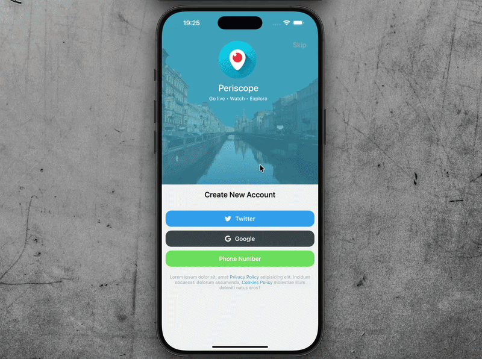
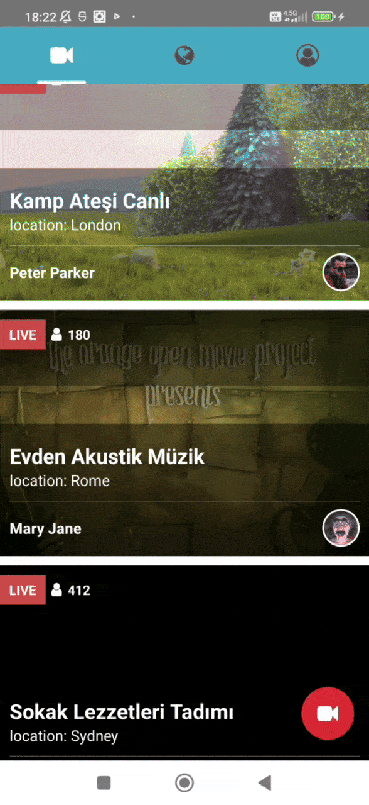

# 🎥 Periscope Clone (React Native)

Periscope benzeri canlı yayın açma ve harita üzerinde yayın konumu gösterme özelliklerine sahip bir mobil uygulama.

Uygulama **React Native** ile geliştirilmiştir.  
Canlı yayın altyapısı **LiveKit (WebRTC)** kullanılarak sağlanmıştır.

---

## 📱 Özellikler

- Kullanıcı kayıt / giriş (JWT), çıkış, silme
- Canlı yayın açma (kamera & mikrofon)
- LiveKit ile gerçek zamanlı video streaming
- Yayın başlarken tek seferlik konum alma
- Harita üzerinde **son yayın konumunu marker olarak gösterme**
- Redux Toolkit ile state yönetimi
- iOS & Android destekli
- Broadcasts videolar dekor amaçlı eklendi, gecikme olabilir

---

### Konum Kullanımı

- Konum yalnızca **yayın başlarken** alınır
- Sürekli konum takibi yapılmaz
- Konum bilgisi Redux’ta saklanır
- Map ekranında sabit marker olarak gösterilir

Bu yaklaşım gizlilik, performans ve batarya kullanımı açısından tercih edilmiştir.

---

## 🧩 Kullanılan Teknolojiler

### Backend

- Node.js
- Express
- MongoDB (Mongoose)
- LiveKit Server SDK
- JWT
- bcrypt
- dotenv
- cors

### Frontend

- React Native
- LiveKit React Native
- WebRTC
- Redux Toolkit
- Redux Persist
- React Navigation
- Axios
- React Native Maps
- Geolocation Service
- Vector Icons

---

## 🤖 Yapay Zeka Desteği

Canlı yayın (LiveKit / WebRTC) entegrasyonu sırasında mimari kararlar ve hata ayıklama süreçlerinde yapay zekadan destek alınmıştır.

---

## ⚠️ Notlar

⚠️ iOS Simülatör’de görülen canlı yayın logları WebRTC kısıtlamalarından kaynaklıdır ve uygulamanın crash olmasına veya gerçek cihaz davranışını etkilemesine neden olmaz.

⚠️ Google Maps API key güvenlik nedeniyle repoya eklenmemiştir.  
Uygulamayı çalıştırmak için kendi API key’inizi `AppDelegate.swift` dosyasına eklemeniz gerekir.

---

## 📸 Screen GIF

### 📡 Canlı Yayın (iOS)

iOS simulatör auth ve live deneyimi.

  

---

### 📡 Canlı Yayın (Android)

Fiziksel kamera ve mikrofon ile canlı yayın test.

  

